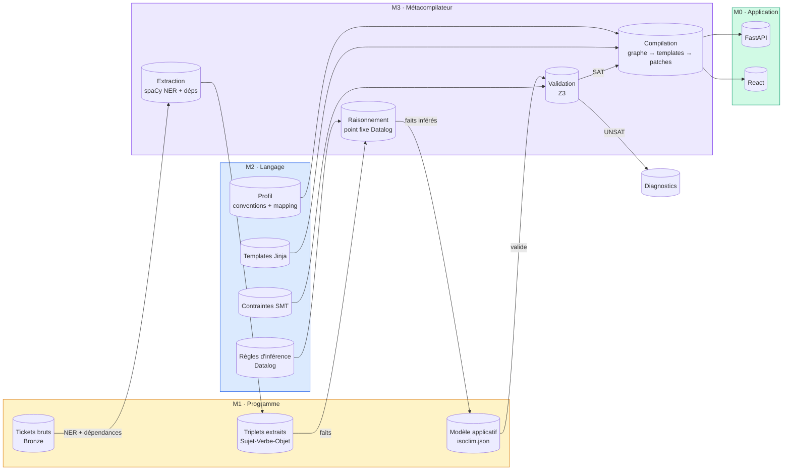

# LOF Framework — Language-Oriented Programming

**LOF** is a generative framework that transforms a declarative DSL into an autonomous software project (FastAPI + React). It validates the model before generation, produces code through Jinja templates and AST patches, then verifies the result with the project's native tools.

The generated project runs **independently** — it does not require LOF at runtime.

## Pipeline



## Ce que le LLM peut modifier

| Composant | Niveau | Modifiable ? |
|-----------|--------|-------------|
| Tickets bruts (Bronze) | M1 | ✅ Ajout uniquement (append-only) |
| Programme DSL (isoclim.json) | M1 | ❌ Jamais — c'est le modèle métier |
| Règles d'inférence | M2 | ✅ |
| Contraintes SMT | M2 | ✅ |
| Templates Jinja | M2 | ✅ |
| Conventions de nommage | M2 | ✅ |
| Mapping verbes | M2 | ✅ |
| Schéma du DSL | M2 | ✅ |
| Métacompilateur (Python) | M3 | ❌ Ne modifie que le compilateur |
| Code généré | M0 | ❌ Jamais — régénéré à chaque compile |

## Quick start

```bash
# Install
uv tool install lof-framework

# Create a project
lof new demo --profile fastapi-react --mode minimal
cd demo

# Compile
lof doctor
lof validate
lof compile
lof check

# Run (generated project is independent)
lof dev
```

Or without installing:

```bash
uvx lof-framework new demo --profile fastapi-react
```

## Generated project independence

The project in `generated/` is a fully standalone FastAPI + React application:

```bash
cd generated
make install
make test
make dev
```

No LOF runtime required.

## Modes

| Mode | Pipeline | Use case |
|------|----------|----------|
| **minimal** | Gold → validate → compile | Direct DSL authoring |
| **standard** | Tickets → Gold → compile | Assisted modeling |
| **intelligent** | Bronze → Silver → Reasoning → Gold → SMT → compile | Full pipeline with NER + inference |

## Project structure

```
my-project/
├── lof.toml           # Project configuration
├── app/
│   ├── bronze/        # Raw tickets (append-only)
│   ├── silver/        # Semantic graph
│   ├── gold/          # DSL application model
│   ├── rules/         # Inference rules
│   ├── constraints/   # SMT constraints
│   ├── templates/     # Jinja templates
│   ├── patches/       # AST patches
│   └── custom/        # User custom code
├── generated/         # Autonomous generated project
├── .lof/              # LOF internal data
└── tests/
```

## Installation from source

```bash
git clone <repo>
cd lof-framework
uv sync
uv run lof --help
```

## Status

**Alpha** — API is experimental and subject to change.

## License

MIT
