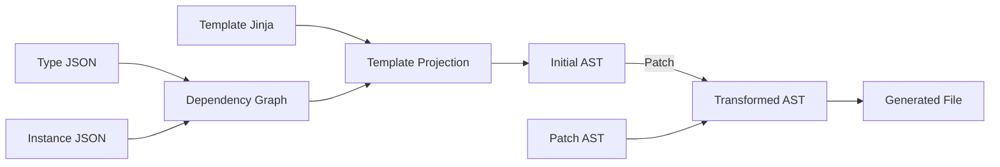

# Architecture

## Directory Structure

```
├── framework/src/lof/     → Python source code
│   ├── models/             → Pydantic data models
│   ├── loading/            → File loading and registry
│   ├── graph/              → Dependency graph
│   ├── rendering/          → Jinja template engine
│   ├── ast/                → AST adapters and patches
│   ├── compilation/        → Compiler, pipeline, writer
│   ├── validation/         → Schema and semantic validation
│   └── utils/              → Naming, hashing, paths
├── schemas/                → JSON Schema files
├── definitions/            → Type and target definitions
├── templates/              → Jinja templates
├── instances/              → Instance definitions
├── patches/                → AST patch definitions
├── generated/              → Build output
└── tools/                  → CLI tools
```

## Pipeline Diagram


